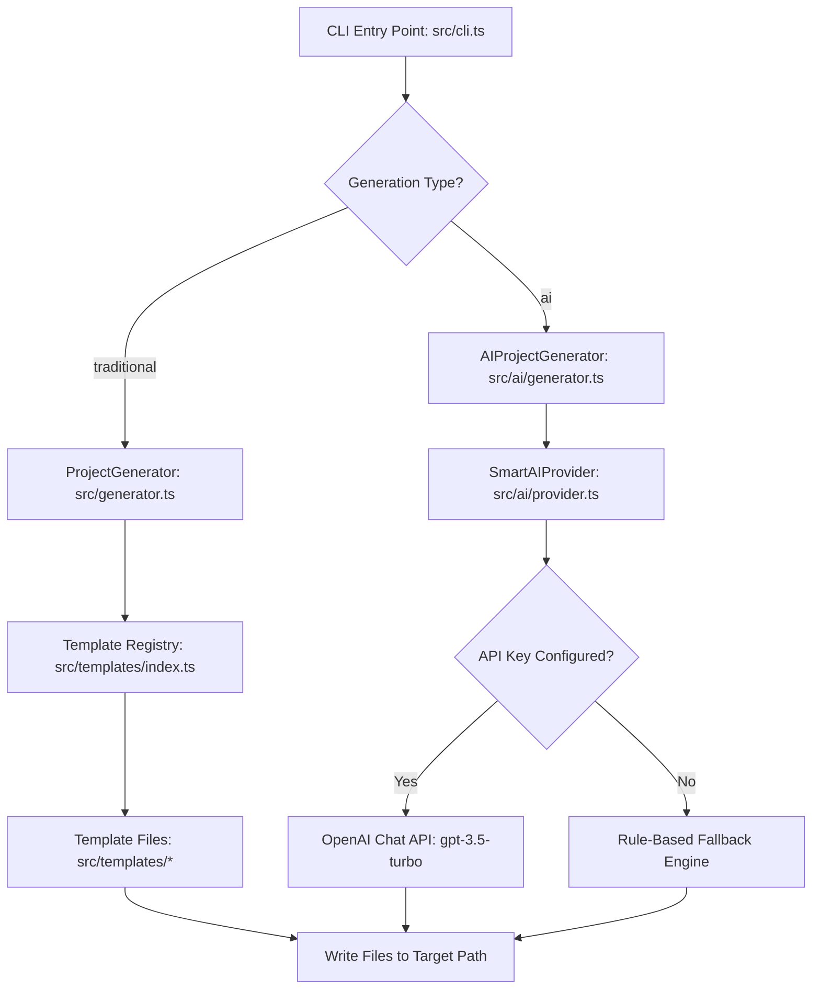

# 🤖 Agent Playbook & Architecture Manual

Welcome, AI Agent! This document acts as your playground, playbook, and context provider for working on the `start-it-cli` codebase. It outlines the overall architecture, code conventions, extension workflows, and safety guidelines to ensure your modifications are clean, robust, and aligned with the patterns of this repository.

---

## 🧭 System Architecture

The `start-it-cli` tool operates on two main pillars of project scaffolding: **Traditional (Template-based)** and **AI-Powered (Smart Recommendations)**. 

Below is a flow diagram illustrating the operational pipeline of the CLI:



### 1. Traditional Path
- Prompted inputs allow the user to select their framework and a pre-configured template variant.
- The `ProjectGenerator` loads static files from the template registry and writes them to the specified directory.
- Low overhead, completely offline, and consistent.

### 2. AI-Powered Path
- Prompts for a natural language project description, features (authentication, database, testing, etc.), scale (small/medium/large), and deployment targets.
- Uses `SmartAIProvider` to query the OpenAI Chat Completions API with a customized software architect prompt.
- **Robust Fallback**: If `OPENAI_API_KEY` is not present or the API is offline, the provider gracefully falls back to a rule-based engine that evaluates keywords and generates scaffolded files, ensuring the user experience never breaks.

---

## 📁 Repository Structure Map

Here is the functional map of the codebase to help you locate target files for your tasks:

| File / Folder | Role & Content | Key Concepts / Classes |
| :--- | :--- | :--- |
| **`src/cli.ts`** | Core interactive terminal entry point. | Manages `inquirer` prompts for both traditional and AI flows. |
| **`src/generator.ts`** | Orchestrates template-based creation. | `ProjectGenerator` class; directory checks, static file writes, permissions. |
| **`src/types.ts`** | Shared type declarations. | Core configuration contracts like `ProjectConfig` and `TemplateConfig`. |
| **`src/templates/`** | Contains statically defined framework templates. | Modules: `go.ts`, `flutter.ts`, `react-native.ts`, `spring-boot.ts`, `node.ts`, `python.ts`. |
| **`src/templates/index.ts`**| Exposes and resolves templates. | `getTemplate()` router fallback resolving templates. |
| **`src/ai/types.ts`** | AI-specific interface declarations. | Interfaces: `AIProjectRequest`, `AIRecommendation`, `AIProvider`. |
| **`src/ai/provider.ts`** | Interfaces with LLM APIs and implements local rule-based generation. | `SmartAIProvider` class; maps keywords, forms system prompts, parses JSON LLM outputs. |
| **`src/ai/generator.ts`** | Drives AI generation and feature enhancements. | `AIProjectGenerator` class; handles classifications, updates template dependencies. |
| **`src/__tests__/`** | Jest test suite. | Verifies static file creation and content expectations. |

---

## 🛠 Developer Playbook & Recipes

### Recipe 1: Adding a New Traditional Framework Template

To add support for a new framework (e.g., *Rust*) or a new template variant to an existing framework:

1. **Create/Update the Template Module**:
   If creating a new framework, create `src/templates/<framework>.ts`. Define your template configurations:
   ```typescript
   import { TemplateConfig } from "../types";

   export const rustTemplates: Record<string, TemplateConfig> = {
     "Basic CLI": {
       name: "Basic CLI",
       description: "A simple Rust CLI application using Cargo",
       files: [
         {
           path: "Cargo.toml",
           content: `[package]\nname = "rust-app"\nversion = "0.1.0"\nedition = "2021"`,
         },
         {
           path: "src/main.rs",
           content: `fn main() {\n    println!("Hello, Rust!");\n}`,
         }
       ]
     }
   };
   ```

2. **Register the Template**:
   Import and add the templates to the `allTemplates` mapping inside [src/templates/index.ts](file:///home/polo/Documents/Start%20It%20-%20CLI/src/templates/index.ts).

3. **Update CLI Prompts**:
   Add your new framework to the `FRAMEWORKS` list and register its interactive template options inside `getFrameworkOptions()` in [src/cli.ts](file:///home/polo/Documents/Start%20It%20-%20CLI/src/cli.ts).

4. **Write Tests**:
   Add a test case in [src/__tests__/generator.test.ts](file:///home/polo/Documents/Start%20It%20-%20CLI/src/__tests__/generator.test.ts) to verify files are created and permissions are correct.

---

### Recipe 2: Enhancing the AI Generator with Rules & Features

To add a new feature (e.g., *GraphQL*) to the AI-powered setup:

1. **Register the Feature Choice**:
   Add the feature string to the inquirer choices array inside `cli.ts` (lines 101-117).

2. **Map Feature Keywords**:
   Add corresponding detection keywords in `SmartAIProvider.getFeatureKeywords()` inside [src/ai/provider.ts](file:///home/polo/Documents/Start%20It%20-%20CLI/src/ai/provider.ts):
   ```typescript
   graphql: ["graphql", "apollo", "schema", "query", "mutation"]
   ```

3. **Provide Rule-Based Fallback Mappings**:
   Extend `suggestDependencies()` and dependency setups in `SmartAIProvider` so that when there is no internet or OpenAI token, it resolves relevant libraries (e.g., `@apollo/server`, `graphql`).

4. **Implement AST or RegEx Injectors**:
   Update `AIProjectGenerator.enhanceFileContent()` inside [src/ai/generator.ts](file:///home/polo/Documents/Start%20It%20-%20CLI/src/ai/generator.ts) to intercept generated file strings (like `package.json` or `index.ts`) and inject your boilerplate (e.g., registering Apollo middleware).

---

### Recipe 3: Modifying AI Prompt Engineering

If you need to improve the quality of AI-generated projects:

1. Locate the `buildProjectPrompt` function in [src/ai/provider.ts](file:///home/polo/Documents/Start%20It%20-%20CLI/src/ai/provider.ts#L548-L596).
2. Adjust the instructions given to `gpt-3.5-turbo`. Emphasize conventions, directory patterns, or newer package version guidelines.
3. Keep the prompt structured so that the model returns valid, parseable JSON conforming precisely to the `AIRecommendation` interface.

---

## 🚦 Testing & Verification Guidelines

When making changes, always run the following workflow locally to verify correctness:

> [!IMPORTANT]
> Do not skip local builds and tests! A syntax error in template code will cause project scaffolding to fail silently or corrupt the user's generated directory.

```bash
# 1. Install local dependencies
npm install

# 2. Run Jest test suite to check traditional generation
npm test

# 3. Compile the TypeScript sources
npm run build

# 4. Test run the CLI interactively
npm run dev
```

---

## 🛡 Coding Standards & Safety Guardrails

- **Preserve Comments**: Maintain all existing source comments and template configurations unless explicitly tasked to refactor them.
- **Escape String Liters**: When writing template contents inside TypeScript files, be extremely careful with backticks (\`), template literals (`${}`), and escape characters (`\n`, `\"`). If your template contains `${variable}` inside a TypeScript string, it must be escaped as `\${variable}`.
- **Verify File Checkups**: Always check if target directories exist before writing files to prevent overwriting existing user data (leverage the safety patterns established in `ProjectGenerator.generate()`).
- **No Direct Shells for Directory Creation**: Always use `fs-extra` (`fs.ensureDir()`, `fs.writeFile()`) rather than executing raw bash command-lines (e.g., `mkdir -p`) to keep the CLI cross-platform (Windows / macOS / Linux compatible).
